#  🧪 Knowledge-Driven Autonomous Materials Research via Collaborative Multi-Agent and Robotic System (MARS)
[](https://python.org)
[](https://vuejs.org)
[](https://fastapi.tiangolo.com)
[](LICENSE)
[](https://github.com/tangger2000/MARS)

MARS is a multi-agent robotic system designed for materials science researchers, enabling **deep research**，**automated material synthesis**, **intelligent experimental planning**, and **real-time data analysis** through AI-driven agent teams.

## 🌟 Core Features

🔬 **Intelligent Material Synthesis** - Automatically generates synthesis protocols for materials like CsPbBr3, Au nanorods, graphene  
🤖 **Multi-Agent Collaboration** - Orchestrator, scientist, engineer, robotic platform, and analyst agents work in synergy  
🧠 **Knowledge-Driven** - Built upon materials science knowledge base  
⚡ **Automatic Error Handling** - Intelligently identifies experimental issues and automatically replans  
🌐 **Web Visualization Interface** - Intuitive multilingual user interface  
🦾 **Robotic Control** - Integrates physical robots for automated experiments  

##  Application Scenarios

-  🧪 **Quantum Dot Synthesis** - CsPbBr3, CsPbBr3@SiO2 quantum dot materials  
-  🥇 **Noble Metal Nanomaterials** - Gold nanorods, silver nanowire synthesis  
-  📑 **2D Materials** - Graphene, black phosphorus liquid-phase exfoliation  
-  🔋 **Core-Shell Structure Design** - Composite material structure optimization  
-  📈 **Experimental Protocol Optimization** - Parameter tuning based on historical data  

##  🏗️ System Architecture

```mermaid
graph TB
    subgraph "🖥️ Frontend Layer"
        FE[Vue.js Web Interface]
    end
    
    subgraph "🧠 Backend Core"
        API[FastAPI Server]
        ORCH[ORCHESTRATOR Agent]
    end
    
    subgraph "👥 Multi-Agent Teams"
        SCI[🔬 Scientist Team]
        ENG[⚙️ Engineer Team] 
        ROB[🤖 Robot Platform]
        ANA[📊 Analyst Team]
    end
    
    subgraph "🗄️ Knowledge & Data"
        KG[📚 GraphRAG Knowledge]
        NEO[Neo4j Database]
        S3[☁️ S3 Storage]
    end
    
    subgraph "🔧 Hardware Interface"
        MW[C# WPF Middleware]
        ROBOT[🦾 Physical Robots]
    end
    
    FE --> API
    API --> ORCH
    ORCH --> SCI
    ORCH --> ENG
    ORCH --> ROB
    ORCH --> ANA
    
    SCI --> KG
    KG --> NEO
    ENG --> S3
    ROB --> MW
    MW --> ROBOT
    ANA --> NEO
```



##  Quick Start

###  📋 Requirements

-  🐍 **Python 3.8+**
-  📦 **Node.js 16+**  
-  🔧 **Visual Studio 2019+** (Middleware only)
-  🗄️ **Neo4j** (Optional, for knowledge graph)

###  ⚡ 15-Minute Quick Experience

```bash
#  One-click launch script
git clone https://github.com/your-org/MARS.git
cd MARS

# Backend launch
cd backend
pip install fastapi autogen-agentchat uvicorn websockets
python main.py  # Terminal interaction mode

# Or start web service
uvicorn api:app --host 0.0.0.0 --port 8000 &

# Frontend launch
cd ../frontend
npm install
npm run dev

# 🌐 Visit http://localhost:3000 to begin!
```

###  🔧 Detailed Configuration

1. **Configure API Keys** (Required)
   ```python
   # Edit backend/constant.py
   OPENAI_API_KEY = "your-openai-api-key"
   OPENAI_BASE_URL = "https://api.openai.com/v1"  # Or other compatible API
   MODEL = "gpt-4o-2024-11-20"
   ```

2. **Knowledge Graph Configuration** (Optional)
   ```yaml
   # Edit graphrag/settings.yaml
   # See GraphRAG documentation
   ```

3. **Robotic Platform Configuration** (Optional)
   ```python
   # Configure robotic platform URI in backend/constant.py
   PLATFORM_HTTP_SERVER_URI = "http://your-robot-platform:50000"
   ```

## 💡 Usage Examples

###  CsPbBr3 Quantum Dot Synthesis

```python
# Enter in web interface or terminal:
"Please design a room-temperature synthesis protocol for CsPbBr3 quantum dots"

# MARS will automatically:
# 1. 🔬 Scientist agent analyzes synthesis pathways
# 2. ️ Engineer agent optimizes experimental parameters  
# 3.  📊 Analyst agent predicts product properties
# 4.  🤖 Robotic platform executes synthesis (if connected)
```

### 📊 Core-Shell Material Design

```python
"Design a CsPbBr3@SiO2 core-shell structure with 5nm core size and 2nm shell thickness"

# System will provide:
# -  📐 Detailed structural design
# -  🧪 Step-by-step synthesis protocol
# - 📈 Expected optical properties
# - ️ Potential issues and solutions
```

##  📚 Practical Cases

We provide extensive real-world operation logs in the `examples/` directory:

###  Material Synthesis Cases
- [CsPbBr3 Nanocube Synthesis](examples/fig5-mars-logs/1.How%20to%20synthesize%20CsPbBr3%20nanocubes%20crystals%20at%20room%20temperature.md)
- [CsPbBr3@SiO2 Core-Shell Structure](examples/fig5-mars-logs/2.%20How%20to%20synthesis%20CsPbBr3@SiO2%20at%20room%20temperature.md)
- [Gold Nanorod Seed-Mediated Synthesis](examples/fig5-mars-logs/3.%20How%20to%20synthesize%20gold%20(Au)%20nanorods%20through%20seed-mediated%20methods.md)
- [Silver Nanowire Polyol Reduction Method](examples/fig5-mars-logs/4.How%20to%20synthesize%20silver%20nanowires(Ag%20NWs)%20through%20the%20polyol%20reduction%20method.md)
- [Graphene Nanoplatelet Synthesis](examples/fig5-mars-logs/5.%20How%20to%20synthesize%20graphene%20nanoplatelets.md)
- [Black Phosphorene Liquid-Phase Exfoliation](examples/fig5-mars-logs/6.%20How%20to%20synthesize%20black%20phosphorene%20by%20liquid-phase%20exfoliation.md)

###  🔧 Error Handling Mechanisms
- [Replanning Example](examples/err-deal/re-plan.md)
- [Tool Call Error Handling](examples/err-deal/tool-call.md)

###  📊 Knowledge Graph Visualization
- [Materials Science Knowledge Graph](examples/graph-of-knowledge-base/)

## 📦 Detailed Installation Guide

###  🐍 Backend Installation (Python/FastAPI)

```bash
# 1. Create virtual environment (recommended)
python -m venv mars-env
source mars-env/bin/activate  # Linux/Mac
# or mars-env\Scripts\activate  # Windows

# 2. Install core dependencies
pip install fastapi uvicorn websockets
pip install autogen-agentchat autogen-ext
pip install openai anthropic  # AI model clients
pip install neo4j minio      # Optional: Knowledge graph and storage

# 3. Verify installation
cd backend
python main.py  # Should see agent startup messages
```

### 🌐 Frontend Installation (Vue.js)

```bash
cd frontend

# Install dependencies
npm install

# Start development mode
npm run dev

# Production build
npm run build

# Verify installation - Visit http://localhost:3000
```

### 🔧 Middleware Installation (C# WPF)

1. Open `middleware/zdhsys.sln` with Visual Studio 2019+
2. Restore NuGet packages
3. Build solution
4. Run generated exe file

### ️ GraphRAG Knowledge Graph (Optional)

```bash
# Install GraphRAG
pip install graphrag

# Configure Neo4j database
# Refer to graphrag/settings.yaml

# Run knowledge graph construction
# See Jupyter Notebooks in graphrag/ directory
```

## 🔍 Troubleshooting

### ❌ Common Issues

**Issue 1: API Key Configuration Error**
```
Error: "OpenAI API key not found"
Solution: Check OPENAI_API_KEY in backend/constant.py
Verification: curl -H "Authorization: Bearer $OPENAI_API_KEY" https://api.openai.com/v1/models
```

**Issue 2: Frontend Cannot Connect to Backend**
```
Error: "Network Error" or "Connection refused"
Solution: 
1. Confirm backend service running at http://localhost:8000
2. Check firewall settings
3. Verify frontend API_URL configuration
```

**Issue 3: Agent Response Anomalies**
```
Error: "Agent timeout" or "No response"
Solution:
1. Check model API quotas and rate limits
2. Adjust timeout parameter in constant.py
3. Check backend logs for detailed errors
```

**Issue 4: Dependency Installation Failure**
```
Error: "Package not found" or "Version conflict"
Solution:
1. Use virtual environment to isolate dependencies
2. Update pip: pip install --upgrade pip
3. Clear pip cache: pip cache purge
```

###  🐛 Debug Mode

```python
# Enable verbose logging in backend/constant.py
SILENT = False  # Show detailed agent output
STREAM = True   # Show real-time conversation flow

# View real-time logs
tail -f backend/logs/mars.log
```

##  🔧 Advanced Configuration

###  🎛️ Model Configuration

Supports multiple AI models:
```python
# backend/constant.py
# OpenAI GPT-4
MODEL = "gpt-4o-2024-11-20"

# DeepSeek
MODEL = "deepseek-v3" 

# Moonshot Kimi
MODEL = "kimi-k2-0711-preview"
```

### ️ Knowledge Graph Configuration

```yaml
# graphrag/settings.yaml
chunks:
  size: 1200
  overlap: 100
  
embeddings:
  provider: openai
  model: text-embedding-3-small
  
llm:
  provider: openai
  model: gpt-4o-2024-11-20
```

###  🤖 Robotic Platform Integration

```python
# Configure robotic HTTP interface
PLATFORM_HTTP_SERVER_URI = "http://robot-platform:50000/sendScheme2RobotPlatform"
MOBILE_ROBOT_HTTP_SERVER_URI = "http://robot-platform:50000/sendScheme2MobileRobot"
```

##  📊 Performance Evaluation

###  🎯 Agent Evaluation System

We provide a complete ELO evaluation system:

```bash
cd evaluate

# Single agent testing
python single_agent_with_rag.py

# Build test dataset
python construct_rag_eval_dataset.py

# Run ELO evaluation
python eval_prompt.py
```

##  📄 License

This project uses MIT License - See [LICENSE](LICENSE) file

## 🙏 Acknowledgments

Thanks to the following open-source projects:
- [AutoGen](https://github.com/microsoft/autogen) - Multi-agent framework
- [FastAPI](https://fastapi.tiangolo.com/) - Modern Python web framework
- [Vue.js](https://vuejs.org/) - Progressive JavaScript framework
- [GraphRAG](https://github.com/microsoft/graphrag) - Knowledge graph RAG
- [Neo4j](https://neo4j.com/) - Graph database