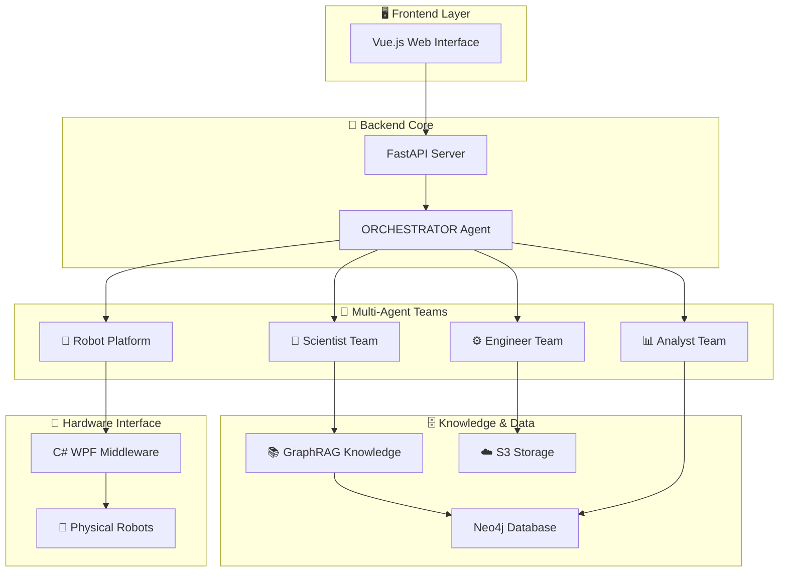

#  🧪 Knowledge-Driven Autonomous Materials Research via Collaborative Multi-Agent and Robotic System (MARS)

[](https://python.org)
[](https://vuejs.org)
[](https://fastapi.tiangolo.com)
[](LICENSE)
[](https://github.com/tangger2000/MARS)

MARS是面向材料科学研究人员的多智能体机器人系统，通过AI驱动的智能体团队实现**自动化材料合成**、**智能实验规划**和**实时数据分析**。

## 🌟 核心特色

🔬 **智能化材料合成** - 自动生成CsPbBr3、Au纳米棒、石墨烯等材料的合成方案  
🤖 **多智能体协作** - Orchestrator、科学家、工程师、机器人平台和分析师智能体团队协同工作 
🧠 **知识驱动** - 基于材料科学知识库  
⚡ **错误自动处理** - 智能识别实验问题并自动重新规划  
🌐 **Web可视化界面** - 直观的多语言用户界面  
🦾 **机器人控制** - 集成物理机器人进行自动化实验  

## 🎯 适用场景

- 🧪 **量子点合成** - CsPbBr3、CsPbBr3@SiO2等量子点材料
- 🥇 **贵金属纳米材料** - 金纳米棒、银纳米线合成
- 📑 **二维材料** - 石墨烯、黑磷烯液相剥离
- 🔋 **壳核结构设计** - 复合材料结构优化
- 📈 **实验方案优化** - 基于历史数据的参数调优

## 🏗️ 系统架构



## 🚀 快速开始

### 📋 环境要求

- 🐍 **Python 3.8+**
- 📦 **Node.js 16+** 
- 🔧 **Visual Studio 2019+** (仅中间件)
- 🗄️ **Neo4j** (可选，用于知识图谱)

### ⚡ 15分钟快速体验

```bash
# 🚀 一键启动脚本
git clone https://github.com/your-org/MARS.git
cd MARS

# 后端启动
cd backend
pip install fastapi autogen-agentchat uvicorn websockets
python main.py  # 终端交互模式

# 或者启动Web服务
uvicorn api:app --host 0.0.0.0 --port 8000 &

# 前端启动
cd ../frontend
npm install
npm run dev

# 🌐 访问 http://localhost:3000 开始使用！
```

### 🔧 详细配置

1. **配置API密钥** (必需)
   ```python
   # 编辑 backend/constant.py
   OPENAI_API_KEY = "your-openai-api-key"
   OPENAI_BASE_URL = "https://api.openai.com/v1"  # 或其他兼容API
   MODEL = "gpt-4o-2024-11-20"
   ```

2. **配置知识图谱** (可选)
   ```yaml
   # 编辑 graphrag/settings.yaml
   # 详见GraphRAG文档
   ```

3. **机器人平台配置** (可选)
   ```python
   # backend/constant.py中配置机器人平台URI
   PLATFORM_HTTP_SERVER_URI = "http://your-robot-platform:50000"
   ```

## 💡 使用示例

### 🧪 CsPbBr3量子点合成

```python
# 在Web界面或终端中输入：
"请帮我设计CsPbBr3量子点的室温合成方案"

# MARS将自动：
# 1. 🔬 科学家智能体分析合成路径
# 2. ⚙️ 工程师智能体优化实验参数  
# 3. 📊 分析师智能体预测产物性质
# 4. 🤖 机器人平台执行合成(如果连接)
```

### 📊 壳核结构材料设计

```python
"设计一个CsPbBr3@SiO2壳核结构，要求核心尺寸5nm，壳层厚度2nm"

# 系统将提供：
# - 📐 详细的结构设计方案
# - 🧪 分步合成协议
# - 📈 预期的光学性质
# - ⚠️ 潜在问题和解决方案
```

## 📚 实战案例

我们在 `examples/` 目录提供了丰富的实际运行日志：

### 🧪 材料合成案例
- [CsPbBr3纳米立方体合成](examples/fig5-mars-logs/1.How%20to%20synthesize%20CsPbBr3%20nanocubes%20crystals%20at%20room%20temperature.md)
- [CsPbBr3@SiO2壳核结构](examples/fig5-mars-logs/2.%20How%20to%20synthesis%20CsPbBr3@SiO2%20at%20room%20temperature.md)
- [金纳米棒种子法合成](examples/fig5-mars-logs/3.%20How%20to%20synthesize%20gold%20(Au)%20nanorods%20through%20seed-mediated%20methods.md)
- [银纳米线多元醇还原法](examples/fig5-mars-logs/4.How%20to%20synthesize%20silver%20nanowires(Ag%20NWs)%20through%20the%20polyol%20reduction%20method.md)
- [石墨烯纳米片合成](examples/fig5-mars-logs/5.%20How%20to%20synthesize%20graphene%20nanoplatelets.md)
- [黑磷烯液相剥离](examples/fig5-mars-logs/6.%20How%20to%20synthesize%20black%20phosphorene%20by%20liquid-phase%20exfoliation.md)

### 🔧 错误处理机制
- [重新规划示例](examples/err-deal/re-plan.md)
- [工具调用错误处理](examples/err-deal/tool-call.md)

### 📊 知识图谱可视化
- [材料科学知识图谱](examples/graph-of-knowledge-base/)

## 📦 详细安装指南

### 🐍 后端安装 (Python/FastAPI)

```bash
# 1. 创建虚拟环境 (推荐)
python -m venv mars-env
source mars-env/bin/activate  # Linux/Mac
# 或 mars-env\Scripts\activate  # Windows

# 2. 安装核心依赖
pip install fastapi uvicorn websockets
pip install autogen-agentchat autogen-ext
pip install openai anthropic  # AI模型客户端
pip install neo4j minio      # 可选：知识图谱和存储

# 3. 验证安装
cd backend
python main.py  # 应看到智能体启动信息
```

### 🌐 前端安装 (Vue.js)

```bash
cd frontend

# 安装依赖
npm install

# 开发模式启动
npm run dev

# 生产构建
npm run build

# 验证安装 - 访问 http://localhost:3000
```

### 🔧 中间件安装 (C# WPF)

1. 使用Visual Studio 2019+打开 `middleware/zdhsys.sln`
2. 还原NuGet包
3. 编译解决方案
4. 运行生成的exe文件

### 🗄️ GraphRAG知识图谱 (可选)

```bash
# 安装GraphRAG
pip install graphrag

# 配置Neo4j数据库
# 参考 graphrag/settings.yaml

# 运行知识图谱构建
# 详见 graphrag/ 目录下的Jupyter Notebook
```

## 🔍 故障排除

### ❌ 常见问题

**问题1: API密钥配置错误**
```
错误信息: "OpenAI API key not found"
解决方案: 检查 backend/constant.py 中的 OPENAI_API_KEY 配置
验证方法: curl -H "Authorization: Bearer $OPENAI_API_KEY" https://api.openai.com/v1/models
```

**问题2: 前端无法连接后端**
```
错误信息: "Network Error" 或 "Connection refused"
解决方案: 
1. 确认后端服务运行在 http://localhost:8000
2. 检查防火墙设置
3. 验证前端API_URL配置
```

**问题3: 智能体响应异常**
```
错误信息: "Agent timeout" 或 "No response"
解决方案:
1. 检查模型API配额和速率限制
2. 调整 constant.py 中的 timeout 参数
3. 查看后端日志获取详细错误信息
```

**问题4: 依赖包安装失败**
```
错误信息: "Package not found" 或 "Version conflict"
解决方案:
1. 使用虚拟环境隔离依赖
2. 更新pip: pip install --upgrade pip
3. 清除pip缓存: pip cache purge
```

### 🐛 调试模式

```python
# backend/constant.py 中启用详细日志
SILENT = False  # 显示智能体详细输出
STREAM = True   # 实时显示对话流

# 查看实时日志
tail -f backend/logs/mars.log
```

## 🔧 高级配置

### 🎛️ 模型配置

支持多种AI模型：
```python
# backend/constant.py
# OpenAI GPT-4
MODEL = "gpt-4o-2024-11-20"

# DeepSeek
MODEL = "deepseek-v3" 

# Moonshot Kimi
MODEL = "kimi-k2-0711-preview"
```

### 🗄️ 知识图谱配置

```yaml
# graphrag/settings.yaml
chunks:
  size: 1200
  overlap: 100
  
embeddings:
  provider: openai
  model: text-embedding-3-small
  
llm:
  provider: openai
  model: gpt-4o-2024-11-20
```

### 🤖 机器人平台集成

```python
# 配置机器人HTTP接口
PLATFORM_HTTP_SERVER_URI = "http://robot-platform:50000/sendScheme2RobotPlatform"
MOBILE_ROBOT_HTTP_SERVER_URI = "http://robot-platform:50000/sendScheme2MobileRobot"
```

## 📊 性能评估

### 🎯 智能体评估系统

我们提供完整的ELO评估系统：

```bash
cd evaluate

# 单智能体测试
python single_agent_with_rag.py

# 构建测试数据集
python construct_rag_eval_dataset.py

# 运行ELO评估
python eval_prompt.py
```

## 📄 许可证

本项目采用MIT许可证 - 详见 [LICENSE](LICENSE) 文件

## 🙏 致谢

感谢以下开源项目的支持：
- [AutoGen](https://github.com/microsoft/autogen) - 多智能体框架
- [FastAPI](https://fastapi.tiangolo.com/) - 现代Python Web框架
- [Vue.js](https://vuejs.org/) - 渐进式JavaScript框架
- [GraphRAG](https://github.com/microsoft/graphrag) - 知识图谱RAG
- [Neo4j](https://neo4j.com/) - 图数据库