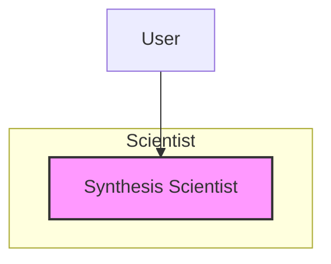
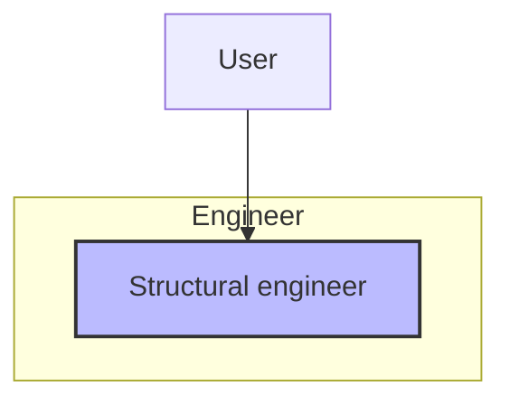

# ---------- TextMessage (user) ----------
How to synthesize black phosphorene (BP) by liquid-phase exfoliation?
# ---------- TextMessage (ORCHESTRATOR) ----------
To plan the synthesis of black phosphorene (BP) via liquid-phase exfoliation, I'll break down the process into manageable subtasks for the appropriate sub-teams.

**Task Breakdown**:
1. Consult with the Synthesis Scientist to identify the optimal liquid-phase exfoliation method and conditions for BP.
2. Engage the Structural Engineer to convert these synthesis instructions into a structured format (e.g., JSON or XML).
3. Use the MobileRobot_Agent and RobotWorkstation_Agent to perform the necessary steps of the synthesis.
4. Once synthesis is complete, engage the DataCollector_Agent to gather the experimental data.
5. Analyze the results using the Expriment_Analyst for any deviations or optimizations needed.

Let's assign these tasks:

| Team_name  | Member_name            | sub-task                                                   |
|------------|------------------------|------------------------------------------------------------|
| Scientist  | Synthesis Scientist    | Consult on liquid-phase exfoliation method for BP          |



**Next sub-task:**
1. Scientist : Consult on liquid-phase exfoliation method for BP

HUMAN
# ---------- TextMessage (User) ----------
approve
# ---------- TextMessage (ORCHESTRATOR) ----------
Thank you for your approval. Let's proceed with the plan:

**Next sub-task:**
1. Scientist : Identify optimal liquid-phase exfoliation method for BP

START
# ---------- ThoughtEvent (Scientist_Admin) ----------

We are given a clear task: to synthesize black phosphorene (BP) by liquid-phase exfoliation.
 The user has approved the plan to handoff to Synthesis_Scientist for identifying the optimal method.
 Therefore, we will now handoff to the Synthesis_Scientist agent.
 We do not need multiple tool calls, just one call to transfer_to_synthesis_scientist.
 Since the function requires no parameters, we pass an empty JSON object.

Based on the approved plan, I'll hand off to the Synthesis Scientist to provide detailed methodology for liquid-phase exfoliation of black phosphorene.
# ---------- TextMessage (Synthesis_Scientist) ----------
To synthesize black phosphorene (BP) using liquid-phase exfoliation, we will follow these detailed steps:

### 1. **Synthesis Conditions**
Black phosphorene is typically synthesized in a controlled environment with precise temperature and solvent conditions. For liquid-phase exfoliation, the ideal conditions typically include:
- **Temperature**: Room temperature (20-25°C).
- **Solvent**: Commonly used solvents include N-Methyl-2-pyrrolidone (NMP) and Dimethylformamide (DMF).
- **Exfoliation Method**: Sonication or shear mixing.

### 2. **Materials & Amounts Required**
The primary materials required for synthesizing BP using liquid-phase exfoliation are:
| Mat.ID | Mat.Name         | Mat.Value | Mat.Unit |
|--------|------------------|-----------|----------|
| M001   | Bulk Phosphorus  | 0.5       | g        |
| M002   | NMP/DMF Solvent  | 100       | mL       |

### 3. **Equipment & Containers**
The process will require specific equipment and containers:
| ID   | Name              | Param/Capacity | Note                    |
|------|-------------------|----------------|-------------------------|
| E001 | Sonicator         | 40 kHz, 120 W  | For liquid exfoliation  |
| C001 | Glass Beaker      | 150 mL         | For mixing              |
| C002 | Centrifuge Tube   | 50 mL          | For separation          |

### 4. **Synthesis Sequence**

1. **Preparation**:
   - Weigh 0.5 g of bulk phosphorus.
   - Measure 100 mL of NMP or DMF solvent.

2. **Exfoliation**:
   - Place the phosphorus in the glass beaker (C001).
   - Add the solvent to the beaker.
   - Subject the mixture to sonication using the sonicator (E001) for up to 8 hours at room temperature.

3. **Separation**:
   - After sonication, transfer the solution to the centrifuge tube (C002).
   - Centrifuge the solution at 5000 rpm for 15 minutes to separate the exfoliated layers.

### 5. **Step-by-Step Process for Final Material Synthesis**
1. **Initial Mixing**: In the glass beaker, combine bulk phosphorus with the solvent. Ensure even distribution to maximize exfoliation efficiency.
2. **Sonication**: Utilize the sonicator for lengthy intervals to break down the layers into few-layer or single-layer black phosphorene.
3. **Centrifugation**: This step will help remove excess solvent and non-exfoliated materials, concentrating the BP in solution form.

### 6. **Characterization of Synthesized Material**
After synthesis, characterizing BP involves several techniques:
- **Raman Spectroscopy**: To verify the layered structure.
- **Transmission Electron Microscopy (TEM)**: To visualize the morphology.

### 7. **Additional Considerations**
- **Safety Precautions**: Handle all solvents with care, use proper ventilation and PPE.
- **Storage Information**: Store the synthesized BP under an inert atmosphere to prevent oxidation.
- **Scalability Challenges**: Consider the solvent recovery systems and cost-effectiveness for larger-scale production.

With these steps, you can achieve the synthesis of black phosphorene via liquid-phase exfoliation. Please ensure all safety guidelines and laboratory protocols are followed meticulously.
# ---------- TextMessage (Scientist_Admin) ----------
To synthesize black phosphorene (BP) using liquid-phase exfoliation, follow these steps:

### Synthesis Conditions
- **Temperature**: Maintain at room temperature (20-25°C).
- **Solvent**: Use N-Methyl-2-pyrrolidone (NMP) or Dimethylformamide (DMF).
- **Method**: Utilize sonication for exfoliation.

### Materials
- **Bulk Phosphorus**: 0.5 grams.
- **Solvent (NMP/DMF)**: 100 milliliters.

### Equipment
- **Sonicator**: 40 kHz, 120 W.
- **Glass Beaker**: 150 mL capacity.
- **Centrifuge Tube**: 50 mL capacity.

### Procedure

1. **Preparation**:
   - Weigh 0.5 g of bulk phosphorus.
   - Measure and pour 100 mL of solvent into a glass beaker.

2. **Exfoliation**:
   - Add phosphorus to the solvent in the beaker.
   - Use a sonicator for up to 8 hours at room temperature.

3. **Separation**:
   - Transfer the solution to a centrifuge tube.
   - Centrifuge at 5000 rpm for 15 minutes.

### Characterization
- Perform **Raman Spectroscopy** and **Transmission Electron Microscopy (TEM)** to assess the structure and morphology of synthesized black phosphorene.

### Safety and Storage
- Ensure proper ventilation and use of PPE when handling solvents.
- Store black phosphorene under an inert atmosphere to prevent oxidation.

These steps provide a guideline for synthesizing black phosphorene via liquid-phase exfoliation, taking into account safety and scalability considerations.
# ---------- TextMessage (ORCHESTRATOR) ----------
Let’s streamline the task by focusing on converting the synthesis instructions into a structured format with the Structural Engineer.

**Task Breakdown**:
1. Engage the Structural Engineer to convert the provided synthesis instructions into a structured format (e.g., JSON or XML).

**Updated Task Assignment**:

| Team_name  | Member_name           | sub-task                                                   |
|------------|-----------------------|------------------------------------------------------------|
| Engineer   | Structural engineer   | Convert synthesis instructions to JSON                     |



**Next sub-task:**
1. Engineer : Convert synthesis instructions to JSON

HUMAN
# ---------- TextMessage (User) ----------
approve
# ---------- TextMessage (ORCHESTRATOR) ----------
Thank you for your approval. Let's proceed with the plan:

**Next sub-task:**
1. Engineer : Convert synthesis instructions to JSON

START
# ---------- TextMessage (Structural_Engineer) ----------
I have successfully generated a task ID and converted the synthesis scheme into a JSON format:

### Task ID
The generated task ID for this operation is: **task_20250407213210**

### JSON Conversion
Here is the JSON representation of the synthesis scheme for black phosphorene (BP) via liquid-phase exfoliation:

```json
{
    "TaskId": "task_20250407213210",
    "ExperimentName": "Black Phosphorene Liquid-Phase Exfoliation",
    "Materials": [
        { "MaterialId": "mat_phosphorus", "Name": "Bulk Phosphorus", "Formula": "P", "Amount": "0.5", "Unit": "grams", "Purity": "98%", "State": "solid"},
        { "MaterialId": "mat_solvent_nmp", "Name": "N-Methyl-2-pyrrolidone", "Formula": "C5H9NO", "Amount": "100", "Unit": "milliliters", "Purity": "99%", "State": "liquid"},
        { "MaterialId": "mat_solvent_dmf", "Name": "Dimethylformamide", "Formula": "C3H7NO", "Amount": "100", "Unit": "milliliters", "Purity": "99%", "State": "liquid"}
    ],
    "Containers": [
        { "ContainerId": "cont_glass_beaker", "Name": "Glass Beaker", "Capacity": "150", "Unit": "milliliters", "MaterialOfConstruction": "glass", "Shape": "cylindrical", "HeatResistant": "yes", "PressureRating": "normal"},
        { "ContainerId": "cont_centrifuge_tube", "Name": "Centrifuge Tube", "Capacity": "50", "Unit": "milliliters", "MaterialOfConstruction": "plastic", "Shape": "tube-shaped", "HeatResistant": "no", "PressureRating": "normal"}
    ],
    "Equipments": [
        {
            "EquipmentId": "equip_sonicator", "Name": "Sonicator",
            "Parameters": {
                "Frequency": "40 kHz",
                "Power": "120 W"
            }
        },
        {
            "EquipmentId": "equip_centrifuge", "Name": "Centrifuge",
            "Parameters": {
                "Speed": "5000 rpm",
                "Duration": "15 minutes"
            }
        }
    ],
    "RobotWorkflow": [
        {
            "StepId": "1", "Description": "Preparation Step",
            "Actions": [
                {
                    "ActionType": "pick_container_with_material", 
                    "ContainerId": "cont_glass_beaker",
                    "MaterialId": "mat_phosphorus",
                },
                {
                    "ActionType": "pick_container_with_material", 
                    "ContainerId": "cont_glass_beaker",
                    "MaterialId": "mat_solvent_nmp"
                }
            ],
            "StepOutput": {
                "ContainerId": "cont_glass_beaker",
                "Contents": [
                    {
                        "MaterialId": "mat_phosphorus",
                        "Amount": "0.5",
                        "Unit": "grams"
                    },
                    {
                        "MaterialId": "mat_solvent_nmp",
                        "Amount": "100",
                        "Unit": "milliliters"
                    }
                ]
            }
        },
        {
            "StepId": "2", "Description": "Exfoliation Step",
            "Actions": [
                {
                    "ActionType": "place_container_into_equipment", 
                    "ContainerId": "cont_glass_beaker",
                    "EquipmentId": "equip_sonicator"
                }
            ]
        },
        {
            "StepId": "3", "Description": "Separation Step",
            "Actions": [
                {
                    "ActionType": "remove_container_from_equipment", 
                    "ContainerId": "cont_glass_beaker",
                    "EquipmentId": "equip_sonicator"
                },
                {
                    "ActionType": "place_container_into_equipment", 
                    "ContainerId": "cont_glass_beaker",
                    "EquipmentId": "equip_centrifuge"
                }
            ]
        }
    ]
}
```

I'll now upload this JSON file to S3 for further use by the synthesis robot platform.

